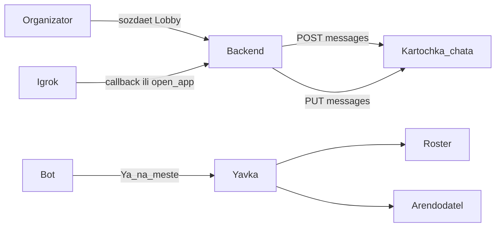

# MAX Sport — продуктовая спецификация

Мини-приложение и бот для MAX: закрыть цикл любительского спорта — от поиска добора и бронирования Площадки до Явки и Кармы.

Термины — в [CONTEXT.md](../CONTEXT.md). Решение «Явка вместо QR» — в [ADR 0001](adr/0001-presence-instead-of-qr.md).

## 1. Проблема

Любительский спорт в чатах ломается по четырём причинам:

1. **«Ищем +2 прямо сейчас»** — игра срывается, если заболел один человек и замену не нашли за час.
2. **Дисбаланс по уровню** — новичок попадает к продвинутым; некомфортно всем.
3. **Финансовая хаотичность** — Организатор платит аренду сам и полдня собирает переводы по 300–500 ₽ в чате.
4. **Регулярные тренировки** — нет учёта постоянных и разовых; no-show никто не отслеживает системно.

Конкуренты (афиши, чаты, доски объявлений) решают только поиск. MAX Sport решает **сбор состава с Амплуа + живую Карточку чата + Явку без ритуала**.

## 2. Продуктовое ядро

Цикл внутри MAX:

1. Организатор создаёт Лобби со Слотами и Амплуа.
2. Шерит Карточку чата в групповой чат.
3. Игрок занимает Слот в один клик (из чата или Mini App).
4. Бот ведёт напоминания и Явку.
5. После игры — короткий опрос → Карма и Игровой паспорт.

Это не «ещё одна афиша событий». Киллер-фичи: **Слот с Амплуа**, **живая Карточка чата**, **фоновая Явка**.



## 3. Акторы

| Актор | Цель |
| --- | --- |
| Организатор | Собрать состав за минуты, видеть кто пришёл, не гоняться за деньгами и отменами |
| Игрок | Найти игру своего уровня и Амплуа, подтвердить участие без лишних действий |
| Арендодатель | Знать, что группа приедет и сколько человек на месте — без отдельного приложения |
| Бот MAX Sport | Карточка чата, напоминания, кнопки Явки, обновление счётчиков |

## 4. Фичи

Формат каждой фичи: зачем → кто → поведение → состояния → края → MVP.

### 4.1. Лобби с Амплуа и Уровнем игры

**Зачем.** Текст «ищем людей» не говорит, кого именно не хватает и какого уровня.

**Кто.** Организатор создаёт; Игрок выбирает подходящий Слот.

**Поведение.**

- Вид спорта (MVP): волейбол, мини-футбол, баскетбол, падел/теннис.
- Формат: разовая игра или регулярная тренировка (например «каждую среду 19:00–21:00»).
- Уровень игры: Новичок / Любитель / Продвинутый — с коротким описанием в UI, чтобы не путать.
- Слоты: число мест; часть Слотов может требовать Амплуа (например «1 связующий»), остальные — «любое».
- Организатор автоматически занимает один Слот (с выбранным Амплуа или без).

**Состояния Лобби.**

| Статус | Смысл |
| --- | --- |
| `draft` | Черновик (опционально; в MVP можно сразу публиковать) |
| `open` | Идёт набор |
| `full` | Все Слоты заняты |
| `gathering` | Окно Явки открыто |
| `started` | Организатор нажал «Начинаем» |
| `finished` | Игра завершена, можно голосовать за Карму |
| `cancelled` | Отменено Организатором |

**Края.**

- Два Игрока одновременно на один Слот — побеждает одна транзакция, второй получает «слот уже занят».
- Смена Амплуа занятого Слота запрещена; Организатор может освободить Слот вручную.
- Регулярное Лобби в MVP: одно ближайшее вхождение + пометка «регулярное»; серия на N недель — later.

**MVP:** да.

### 4.2. Лента и карта

**Зачем.** Ответ на вопрос: «Где и во что я могу сыграть сегодня?»

**Кто.** Игрок.

**Поведение.**

- Переключатель: лента / карта.
- Быстрые фильтры (chips): мои виды спорта, рядом, Горящие слоты.
- Карточка в ленте: спорт, статус («нужен 1 человек»), Площадка + расстояние, время, матрица Слотов (аватарки + подсветка нужного Амплуа), Сплит ₽/чел.
- Карта (MVP): упрощённые пины Площадок + список по тапу; полный гео-поиск по радиусу — заложить в схему, не обязан быть идеальным на питче.

**Края.**

- Нет гео — фильтр «рядом» недоступен или работает по выбранному району/городу (заглушка).
- Пустая лента — CTA «Создать Лобби» или ослабить фильтры.

**MVP:** да (лента обязательна; карта — упрощённая).

### 4.3. Конструктор Лобби

**Зачем.** Собрать игру меньше чем за 30 секунд.

**Кто.** Организатор.

**Поведение (шаги).**

1. Вид спорта.
2. Площадка — из избранных или новый адрес.
3. Дата и время (для регулярной — день недели + время).
4. Число игроков → система создаёт Слоты.
5. Опционально: пометить нужные Амплуа («нужен 1 связующий и 2 блокирующих»).
6. Общая сумма аренды → Сплит считается автоматически.
7. Чекбокс «Защита от no-show» → включить Залог.

После создания — экран Лобби и кнопка «Поделиться в MAX».

**Края.**

- Сумма 0 — бесплатное Лобби, Залог недоступен.
- Число игроков < 2 — ошибка валидации.
- Редактирование после публикации: время/Площадка — с уведомлением записавшимся; уменьшение числа Слотов ниже занятых — запрещено.

**MVP:** да.

### 4.4. Карточка чата

**Зачем.** Групповой чат — место, где реально собирают состав. Карточка должна жить там, а не требовать «зайди в приложение».

**Кто.** Организатор шерит; Игроки кликают; бот обновляет.

**Поведение.**

У MAX нет живого iframe-виджета в переписке. Карточка чата — **редактируемое сообщение бота** (текст + inline keyboard):

```
🏐 Волейбол • Среда, 19:00
📍 ФОК «Центральный»
👥 Заполнено: 11 / 12  [██████████░]
🔥 Срочно нужен: 1 Связующий
💰 350 ₽ / чел

[ ⚡ Занять слот ]   [ Подробнее ]
```

- `callback` «Занять слот» — вход в 1 клик из чата (если свободных Слотов с Амплуа несколько — бот уточняет выбор кнопками).
- `open_app` «Подробнее» — диплинк `https://max.ru/<bot>?startapp=lobby_<id>`.
- При каждом бронировании / отмене бот делает `PUT /messages` — счётчик обновляется у всех в чате.
- Шеринг из Mini App: `shareMaxContent({ mid })` — переслать уже собранную Карточку чата, не сырой текст. Fallback: диплинк `:share` с текстом и ссылкой.

**Состояния текста карточки.**

- Есть свободные Слоты с Амплуа → строка «Срочно нужен: …».
- `full` → «Состав собран» + кнопка «В лист ожидания» (лист ожидания — later; в MVP можно скрыть кнопку).
- `cancelled` / `finished` → текст-статус, кнопки входа убраны.

**Края.**

- Бот не состоит в чате — шеринг через выбор чата пользователем (`shareMaxContent` / `:share`).
- Rate limit API — очередь обновлений карточки, итог всегда сходится к актуальному счётчику.
- Игрок без диалога с ботом жмёт callback — сначала `/start`, затем повтор действия.

**MVP:** да (киллер для питча).

### 4.5. Сплит и микро-Залог

**Зачем.** Убрать хаос переводов и снизить no-show.

**Кто.** Организатор задаёт сумму; Игрок видит свою долю при записи.

**Поведение.**

- `доля = ceil(аренда / число_слотов)` или пересчёт по фактически занятым — **фиксируем для MVP:** доля от **планового** числа Слотов (предсказуемо для Игрока). Пересчёт при недоборе — later / ручное решение Организатора.
- При записи в платное Лобби с Залогом: статус платежа `hold_pending` → `held` (мок).
- Списание доли аренды: статус `charge_pending` при `full` или по кнопке Организатора «Собрать оплату» (мок).
- No-show (нет Явки «на месте» к T+15 и не было отмены) → Залог идёт в покрытие аренды (статус `forfeit`).
- Отмена Игроком ≥ 2 часов до старта → Залог возвращается (`released`), Слот освобождается, Карточка чата обновляется.

**Реальные платежи MAX на хакатоне не подключаем** — полный UX и статусы, деньги мокаем.

**Края.**

- Бесплатное Лобби — блок оплаты скрыт.
- Организатор не платит Залог сам себе (или платит долю аренды без Залога — зафиксировать в UI: Организатор без Залога).

**MVP:** да (мок). Реальный эквайринг — later.

### 4.6. Явка

**Зачем.** QR ломает реальный сбор: люди приходят вразнобой, Организатор не стоит со сканером. Нужна фоновая система, которая напоминает и почти не требует действий. Подробнее — [ADR 0001](adr/0001-presence-instead-of-qr.md).

**Кто.** Игрок подтверждает; Организатор смотрит Ростер; Арендодатель получает пинги.

**Таймлайн (T = время старта Лобби).**

| Когда | Кому | Что |
| --- | --- | --- |
| T−24ч | Игрок | «Идёшь?» → `Иду` / `Не смогу` |
| T−2ч | Игрок | Повтор подтверждения; отмена здесь ещё освобождает Слот без штрафа Залога |
| T−30 мин | Игрок | «Выезжай» + адрес + маршрут |
| [T−20; T+15] | Игрок | Кнопка `Я на месте` в сообщении бота; опционально авто по гео в радиусе Площадки |
| T−60 мин | Арендодатель | «Группа на подходе, явка N/M» (если чат Площадки подключён) |
| В окне Явки | Организатор | Живой Ростер; ручная отметка как запасной путь; «Начинаем» закрывает окно |

**Статусы Явки.**

| Статус | Смысл |
| --- | --- |
| `expected` | Записан, ещё не подтверждал T−2ч |
| `on_the_way` | Подтвердил «Иду» на T−2ч / T−24ч |
| `on_site` | Нажал «Я на месте» или авто-гео |
| `no_show` | К T+15 нет `on_site` и не отменился вовремя |
| `cancelled` | Снялся сам (≥ 2ч — без штрафа Залога) |

**Гео.** Усиление, не обязаловка. Нет разрешения — один тап «Я на месте». Радиус Площадки (ориентир 150–300 м) настраивается константой.

**Арендодатель (лёгкий слой).**

- При создании/публикации Лобби бот может отправить в чат Площадки: время, зал, спорт, число человек, Организатор.
- Без кабинета, без обучения персонала, без сканеров.
- На питче достаточно скрина сообщения (не отдельный продукт).

**Края.**

- Игрок без телефона — Организатор отмечает вручную в Ростере.
- Организатор сам тоже проходит Явку (или авто `on_site` при «Начинаем» — допустимо).
- Лобби отменено — цепочка напоминаний останавливается.

**MVP:** да. QR — out of scope.

### 4.7. Карма

**Зачем.** Организатор видит, кому можно доверять слот в горящем Лобби.

**Кто.** Все участники после `finished`.

**Поведение.**

- Пуш с опросом ~10 секунд:
  1. Надёжность: пришёл вовремя / опоздал / не пришёл (по умолчанию подставляется из Явки, можно поправить).
  2. Один спортивный тег: «отличный командный», «крутой пас», «пушечный удар» и т.п. (набор зависит от спорта).
- Агрегаты: % посещаемости, число игр, бейджи («Спасатель матча» — занял Горящий слот и дошёл до `on_site`).

**Края.**

- Не проголосовал — Явка всё равно влияет на надёжность.
- Накрутка: один голос на пару (voter, target, lobby); самоголосованию нет.

**MVP:** да (упрощённый опрос + 1–2 бейджа).

### 4.8. Игровой паспорт

**Зачем.** Витрина репутации при одобрении / просмотре состава.

**Кто.** Игрок смотрит свой; Организатор — чужой из Лобби.

**Поведение.**

- Имя / аватар из MAX.
- Надёжность (%), число игр, Уровень игры (самооценка + косвенно из истории).
- Бейджи.
- Ближайшее Лобби: статус Явки; в окне Явки — кнопка «Я на месте».
- **Без QR-пропуска.**

**MVP:** да.

## 5. Экраны Mini App

Стек UI: **React + MAX UI + MAX Bridge**.

### Screen 1. Home (лента / карта)

- Header: поиск + аватар с индикатором надёжности.
- Переключатель: лента | карта.
- Chips: мои виды спорта, рядом, Горящие слоты.
- Item card: спорт, «нужен N», Площадка, время, матрица Слотов, Сплит.

### Screen 2. Lobby Detail

- Инфо: миникарта / адрес, время, маршрут (внешняя ссылка).
- Сетка Слотов с Амплуа и кнопкой «Занять».
- Финансовый блок: аренда → ваша доля; пометка про Залог.
- Sticky: «Поделиться в MAX» + «Присоединиться».

### Screen 3. Create Lobby

Шаги из §4.3. Цель — < 30 секунд до публикации.

### Screen 4. Карточка чата (не экран приложения)

Макет сообщения бота — §4.4. В Figma/питче показывать как UI чата MAX.

### Screen 5. Игровой паспорт

§4.8. Вместо QR — блок ближайшей игры и «Я на месте» в окне Явки.

### Screen 6. Organizer Roster

- Список Игроков с статусами Явки.
- Ручная отметка.
- «Начинаем» → Лобби `started`, окно Явки закрыто.
- Алерт, если кто-то отменился в последний момент (Слот снова горит).

### Pitch-only: Venue ping

Скрин сообщения Арендодателю. Отдельный кабинет не делаем.

## 6. Сценарий защиты (user journey)

1. **T−2ч.** Организатор открывает MAX Sport, выбирает сохранённую Площадку, за ~20 секунд создаёт Лобби: «Волейбол, остался 1 Слот: Связующий». Сплит считается сам.
2. **Шеринг.** Организатор жмёт «Поделиться» → Карточка чата в групповом чате компании. Счётчик живой.
3. **1 клик.** Игрок жмёт «Занять слот» в чате, подтверждает Амплуа «Связующий». Карточка: `12/12`.
4. **Явка.** T−30 — «Выезжай». У Площадки — «Я на месте» (или авто-гео). Ростер зеленеет. Арендодатель видит «12/12 на месте».
5. **Карма.** После игры — 10-секундный опрос. Игроку-спасателю — бейдж «Спасатель матча».

Запас на площадке финала: заранее записанный screencast на телефоне.

## 7. MVP vs later

### В MVP (хакатон)

- Лобби, Слоты, Амплуа, Уровень игры (виды спорта: волейбол, мини-футбол, баскетбол, падел/теннис).
- Лента + упрощённая карта.
- Конструктор Лобби.
- Карточка чата (post + edit message).
- Сплит + Залог как **мок-статусы**.
- Явка: напоминания, «Я на месте», опциональное гео, Ростер, пинг Арендодателю.
- Карма (короткий опрос) + Игровой паспорт.
- Auth через `initData` (HMAC).
- Архитектура: TypeScript-монолит (Mini App отдельно, API+бот вместе) + PostgreSQL (+ PostGIS в схеме) + Redis Pub/Sub для live в Mini App. **Без Kafka.**

### Out of scope / later

- QR и любой сканер.
- Kafka / полноценная EDA.
- Киберспорт (размывает историю для трека «досуг» и ведомств).
- Реальные платежи и эквайринг.
- Полноценный кабинет Арендодателя.
- Лист ожидания, сложный пересчёт Сплита при недоборе.
- Серия регулярных тренировок на N недель с отдельным учётом абонемента.
- Тяжёлая интерактивная карта как отдельный продукт.

## 8. Технологии (кратко)

Развёрнуто: [STACK.md](STACK.md), домен и сервер: [INFRA.md](INFRA.md).

| Слой | Выбор |
| --- | --- |
| Mini App | React + MAX UI + MAX Bridge, URL `https://max-sport.sabirov.tech` |
| Бот | Официальный `@maxhub/max-bot-api` (TypeScript). События только Webhook, не Long Polling |
| Бизнес-API | Fastify (TypeScript), тот же процесс что и webhook; исходящие вызовы → `platform-api2.max.ru` |
| DB | PostgreSQL + PostGIS |
| Realtime в приложении | Redis Pub/Sub + SSE или WebSocket |
| Realtime в чате | `PUT /messages` у Карточки чата |
| Auth | Валидация `initData` (HMAC-SHA256 от токена бота) |
| Шеринг | `shareMaxContent` / диплинки `?startapp=` и `:share` |

Гибрид Event-Lite: ACID-операции (бронь Слота, статусы оплаты) — синхронно в Postgres; уведомления и правка Карточки чата — фоном.

Python FastAPI из раннего наброска не используем: официальные библиотеки бота — JS и Go. Mini App уже на React, поэтому бот и API — TypeScript.

## 9. Критерии готовности к питчу

- [ ] Демо-путь из §6 проходит без ручных правок в БД.
- [ ] Карточка чата обновляет счётчик на глазах жюри.
- [ ] Ростер показывает смену Явки после «Я на месте».
- [ ] Игровой паспорт показывает бейдж после опроса.
- [ ] Screencast того же сценария сохранён офлайн.
- [ ] На слайде архитектуры — модули + Redis event bus (без обещания Kafka в проде завтра).

## 10. Открытые решения (не блокеры спеки)

1. Точная формула Сплита при недоборе состава перед стартом.
2. Нужно ли Организатору вручную «одобрять» заявки или вход в Слот всегда мгновенный (для MVP рекомендуем **мгновенный** вход; approve — later для закрытых Лобби).
3. Радиус авто-гео и политика ложных срабатываний.
