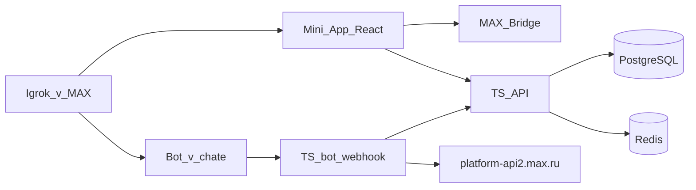

# Стек MAX Sport

Пока только решение на бумаге. Код не пишем, пока не закроем продуктовую документацию.

## Что официально даёт MAX

Источник: [Подготовка к разработке бота](https://dev.max.ru/docs/chatbots/bots-coding/prepare).

| Что | Официально | Пакет / ссылка |
| --- | --- | --- |
| Бот, TypeScript / JavaScript | Да | [`@maxhub/max-bot-api`](https://dev.max.ru/docs/chatbots/bots-coding/js) |
| Бот, Golang | Да | [`max-bot-api-client-go`](https://dev.max.ru/docs/chatbots/bots-coding/go) |
| Mini App | Да | HTML/JS/CSS + [MAX Bridge](https://dev.max.ru/docs/webapps/bridge) + [MAX UI (React)](https://dev.max.ru/docs/webapps/introduction) |
| Бот, Python | Нет | REST `platform-api2.max.ru` вручную или сторонние обёртки |

Официальной Python-библиотеки у MAX нет. Community-пакеты вроде `maxapi` существуют, но это не документация платформы: жюри смотрит на JS/Go, а обёртка может отстать от API.

## Рекомендация

**Один язык: TypeScript.**

- Mini App и так React + MAX UI + Bridge.
- Бот — официальный `@maxhub/max-bot-api`, события **только Webhook** (не Long Polling). См. [ADR 0002](adr/0002-webhook-not-long-polling.md).
- Бизнес-API лобби (слоты, явка, карма) — тот же Node-процесс на **Fastify**.

Golang оставляем запасным, если понадобится отдельный высокопроизводительный кусок. Для MVP хакатона не нужен.

База и realtime без смены смысла:

- PostgreSQL + PostGIS — профили, лобби, гео Площадок.
- Redis Pub/Sub — live-счётчик в Mini App.
- Карточка чата живёт не через сокет, а через `PUT /messages` бота.

## Как слои связаны с MAX

Mini App не ходит в Bot API с браузера: токен бота только на сервере. Клиент шлёт `initData`, сервер проверяет HMAC и уже сервер пишет в MAX.

## Каналы доставки

Домен (Лобби, Слот, Явка) общий. Мессенджеры — адаптеры у края Fastify. Решение: [ADR 0005](adr/0005-channel-adapters.md).

- Публичный контур хакатона: MAX, `POST /webhook`.
- Второй транспорт (не для сцены): отдельный path webhook, тот же API лобби.
- Питч, screencast и PRODUCT — только MAX UI и Карточка чата MAX.

## Канал событий бота: только Webhook

MAX не даёт держать Webhook и Long Polling одновременно. Решение: [ADR 0002](adr/0002-webhook-not-long-polling.md).

- Подписка: `POST /subscriptions` → `https://max-sport.sabirov.tech/webhook`
- Платформа считает Webhook основным каналом для продуктовых интеграций

## HTTP: Fastify

Один процесс: webhook + REST Mini App + healthz. Решение: [ADR 0003](adr/0003-fastify.md).

Почему не остальные:

| Вариант | Почему нет |
| --- | --- |
| NestJS | Слишком много каркаса на 2 недели |
| Express | Нет схемы и нормальных типов из коробки |
| Hono | Силён на edge; мы на VPS с Postgres/Redis |

`bot.start()` SDK не используем — это Long Polling. Fastify принимает `POST /webhook` и отдаёт Update в `@maxhub/max-bot-api`.

